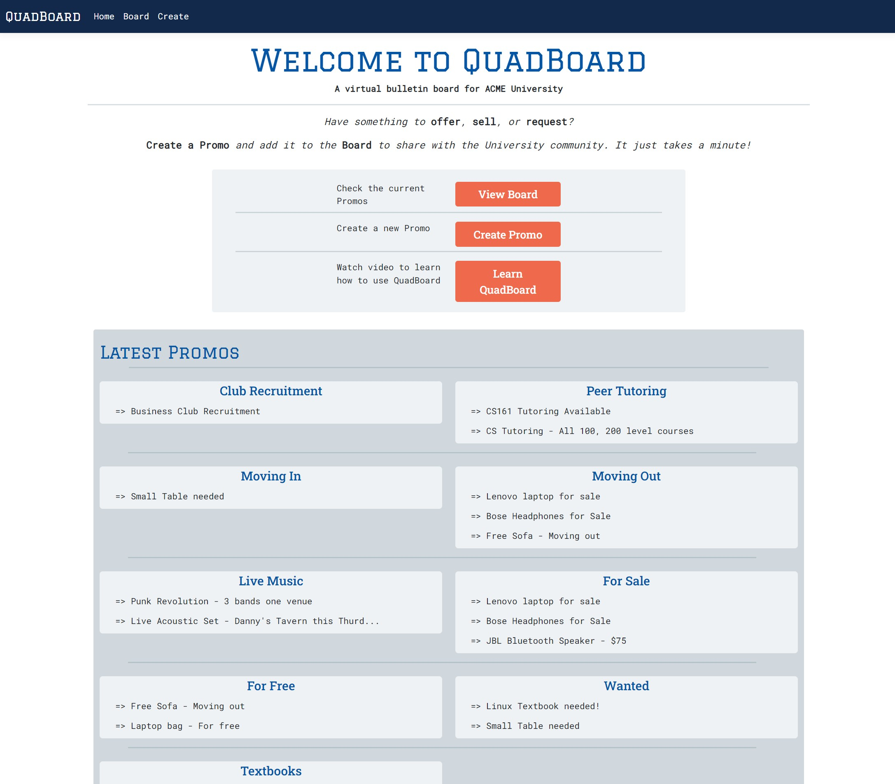
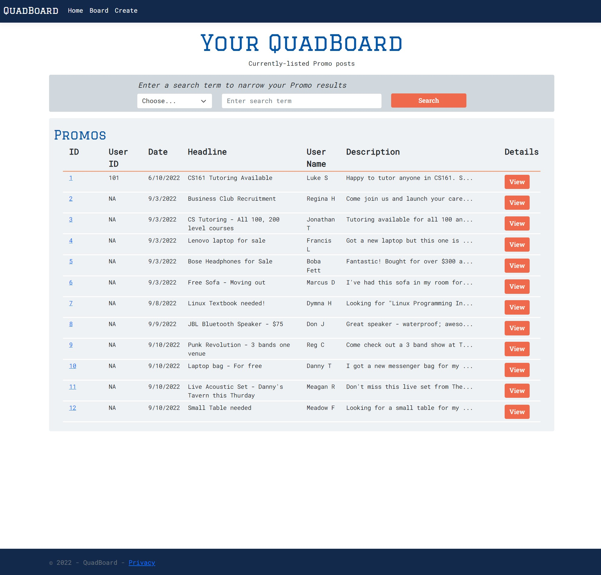
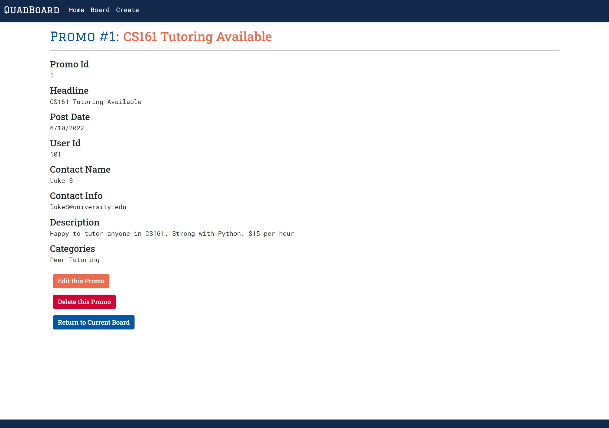

# University Bulletin Board App

## Class Project - CS 361
### Joel Swenddal
---

## Overview
This web app provides a bulletin board service for a generic university community (similar to a Craigslist concept). Students can make promotional posts to share various categories of offers and requests with other students. The current version supports Create, Read, Update and Delete operation on postings.

## Goals
A primary goal of the project was to develop the application while displaying understanding of core software engineering concepts and best practices. A key class objective was to integrate the app with a classmate's microservice. A personal goal was to build in .NET with C#, which is relatively new to me. I hadn't had prior experience developing a .NET web app. Finally, I also wanted experience developing the database using MS SQL Server (getting additional SQL experience) and deploying in the Cloud with Azure.

## Technologies
.NET 6.0 w/C#

EntityFrameworkCore.SqlServer

SQL Server

## Design notes
The app is designed with the MVC pattern (using recommended .NET implementation of it) and features server-side rendering of views (Razor pages).

## Images
Home Page

Board Page

Item Page

